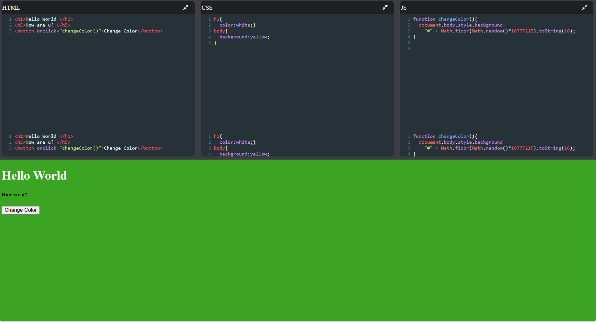

🚀 CodePen-clone – Online Code Editor

CodePen is a web-based code editor. It allows users to write HTML, CSS, and JavaScript in separate panels and instantly preview the output in real time.

🌐 Live Demo

Live Website:
https://codepen-clone-zeta-eight.vercel.app

✨ Features

* Real-time code preview
* Separate HTML, CSS, and JavaScript editors
* Responsive user interface
* Auto-updating output panel
* Clean and modern design
* Beginner-friendly project structure

🛠️ Built With

* React.js
* JavaScript (ES6+)
* HTML5
* CSS3
* CodeMirror
* Font Awesome
* Vercel

📸 Screenshot

